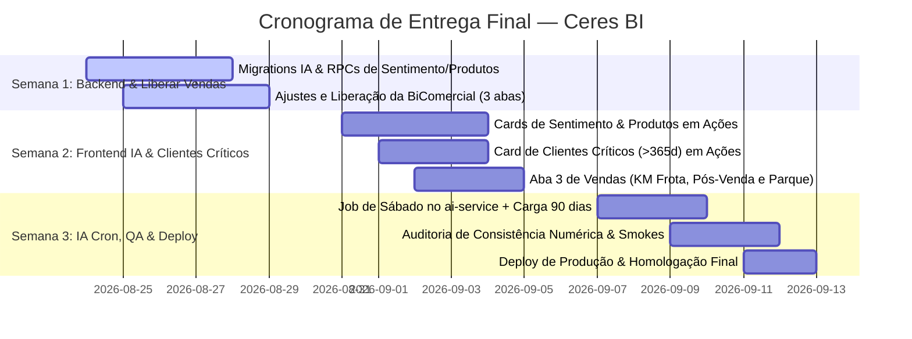

# Plano de Consolidação — Ceres BI

**Autor:** Kiro (IA #1)
**Data:** 19/08/2026
**Status:** Consolidação em revisão técnica — a decisão de fechamento está na Visão IA #4 ao fim do documento.

---

## Contexto do Problema

O cliente criou ~10+ dashboards separadas no escopo original do BI. Isso está travando a entrega porque:

1. Muitas dashboards com poucos dados cada
2. Alta redundância entre elas (mesmos dados em dashboards diferentes)
3. Fragmentação dificulta manutenção e evolução

**Objetivo:** Consolidar tudo em 2-3 dashboards novas (além das 3 já entregues), eliminar redundâncias, e agregar análises de IA semanais.

---

## Dashboards Já Entregues (3)

### 1. Ações (`/bi/acoes`)
- KPIs comerciais (total ações, visitas, oportunidades, ganhos, perdas)
- Funil de conversão
- Ranking de consultores (ações, visitas, valor)
- Esforço × Retorno (scatter plot)
- Termômetro de metas
- Evolução mensal
- Gestão de carteira
- Mapa de oportunidades (geográfico)
- Tabelas paginadas com filtros

**Já mata 3 coisas:**
- Oportunidades (ações com tipo oportunidade)
- Ganhos (pedidos com status ganho + aprovado)
- Perdas (negócios perdidos)

### 2. Equipe (`/crm/consultores`)
- Performance individual por consultor
- Ranking top 5
- Cards por consultor com métricas
- Tabela de conferência auditável
- CRM Quality Score
- Insights IA (equipe + individual, gerados semanalmente)
- Drill-down com evolução temporal

### 3. Atividades (`/crm/registros`)
- Log operacional de ações
- Tabela com busca inteligente
- Modal de detalhe
- Paginação
- Expansão para ano inteiro

---

## Dashboards Pendentes do Cliente (lista original)

| # | Dashboard pedida | O que mostra | Redundância |
|---|-----------------|--------------|-------------|
| 1 | Total de Pedidos | Pedidos ganhos, valores | ⚠️ Ações já mostra ganhos (pedidos = ganhos) |
| 2 | Pós-Venda e Serviços | Técnicos, KM rodado | ✅ Dado único — técnico/campo |
| 3 | Produtividade Técnica | KM, visitas técnicas, base instalada | ✅ Pode juntar com Pós-Venda |
| 4 | Base Instalada | Equipamentos no cliente | ✅ Dado único |
| 5 | Carteira de Clientes | Prospectos, clientes ativos, por consultor | ⚠️ Parcial em Ações (gestão de carteira) |
| 6 | Inteligência | Análises de dados | ⚠️ Já feito via IA em Equipe |
| 7 | Receita por Cidade | Faturamento geográfico | ⚠️ Mapa de oportunidades em Ações |
| 8 | Painel Comercial | Visão comercial geral | ❌ 100% redundante com Ações |
| 9 | Mapa de Cobertura | Ações georreferenciadas | ⚠️ Ações já tem mapa |
| 10 | Pipeline | Funil de vendas | ❌ 100% redundante com Ações (funil) |
| 11 | Clientes Sem Contato | Clientes inativos há X tempo | ✅ Dado único — crítico |
| 12 | Notas do Campo | Descrições/observações de campo | ✅ Base para análise de IA |
| 13 | Gestão Interna | Métricas internas | 🔒 Deixar para depois |
| 14 | Visão Geral | Dashboard resumo | ⚠️ Cosmética, não prioritária |

---

## Redundâncias Identificadas

1. **Ranking consultores:** duplicado entre Ações e Equipe (RPCs diferentes, mesma lógica visual)
2. **Taxa de conversão:** agregado em Ações + individual em Equipe
3. **Pedidos/Ganhos:** Ações já mostra (pedido = negócio com status ganho + pedido aprovado)
4. **Pipeline/Funil:** Ações já tem funil de conversão completo
5. **Painel Comercial:** idêntico a Ações
6. **Mapa/Cobertura/Receita por cidade:** Ações já tem mapa de oportunidades
7. **Inteligência:** já existe via AI Service nos insights de Equipe

---

## Proposta de Consolidação

### Manter como está:
- **Equipe** — completa, com IA
- **Atividades** — log operacional, simples e funcional

### Expandir:
- **Ações** — absorve Clientes Críticos, Conversão Anual, Evolução 12m, e Cards de IA

### Criar NOVA:
- **Vendas & Resultados** — absorve Pedidos, Pós-Venda, Produtividade Técnica, Base Instalada, Carteira

### Descartar:
- Painel Comercial (redundante)
- Pipeline (redundante)
- Mapa de Cobertura isolado (redundante)
- Receita por Cidade isolada (redundante)
- Inteligência separada (já existe em Equipe + IA)
- Visão Geral (cosmética, não agrega)

---

## Estrutura Final Proposta (4 dashboards)

### Dashboard 1: Ações (expandida)
**Abas existentes + novas:**
- Aba 1: Visão Geral (KPIs, funil, ranking) — já existe
- Aba 2: Evolução (mensal + 12 meses ganhos×perdidos) — expandir
- Aba 3: Mapa & Cobertura — já existe
- Aba 4: Clientes Críticos (sem contato há X dias) — NOVO
- Aba 5: Inteligência IA — NOVO
  - Card: Sentimento da semana (positivo/neutro/negativo)
  - Card: Produtos de maior interesse
  - Heatmap de sentimento por consultor/período

### Dashboard 2: Equipe (mantém)
Sem alterações. Já tem IA integrada.

### Dashboard 3: Atividades (mantém)
Sem alterações.

### Dashboard 4: Vendas & Resultados (NOVA)
**3 abas:**
- Aba 1: Vendas — total pedidos, ticket médio, evolução, por consultor
- Aba 2: Pedidos/Itens — detalhamento por item, grupo, marca, modelo
- Aba 3: Carteira & Mercado — base instalada, KM rodado, produtividade técnica, cobertura

> **Nota:** A BiComercial já existe implementada no código mas não está liberada. Pode ser a base para esta dashboard.

---

## Plano de Análise de IA

### Infraestrutura existente
- AI Service: FastAPI + OpenRouter (Llama 3.1 70B)
- Cron: já roda sábados para insights de ações
- Container: `ceresbi_ai` no Docker Swarm
- Custo atual: ~$0.03/semana

### Job 1: Análise de Sentimento

**Objetivo:** Classificar ações da semana em positivo/neutro/negativo, extrair palavras-chave.

**Palavras positivas (exemplos):**
- interesse, comprar, fechar, pedido, assinatura, satisfeito, renovar, aprovar, parceria

**Palavras negativas (exemplos):**
- concorrente, caro, problema, atraso, financeiro, prejuízo, cancelar, insatisfeito, devolver

**Fonte de dados:**
| Campo | Tabela | Volume | Preenchimento |
|-------|--------|--------|---------------|
| `aco_atividadeexecutada` | vw_acoes_ativas | ~28k registros | ~97%, ~208 chars média |
| `ngo_obsnegocio` | vw_negocios | ~4.7k | variável |
| `ngo_obs_motivo_ganho` | vw_negocios | subset de ganhos | — |
| `ngo_obs_motivo_perda` | vw_negocios | subset de perdas | — |

**Output:**
- Tabela: `ai_sentimento_semanal` (consultor, semana, classificação, palavras-chave, score)
- RPCs de agregação para o frontend
- Visualização: heatmap por consultor/semana

### Job 2: Produtos de Maior Interesse

**Objetivo:** Extrair menções a produtos/máquinas/equipamentos nas descrições, normalizar contra taxonomia conhecida.

**Fonte de dados:**
- `aco_atividadeexecutada` (descrições de ações)
- `ngo_obsnegocio` (descrições de negócios)
- `aco_atividade_a_executar` (planejamento)

**Taxonomia de validação (ground truth):**
- `pdo_itemgrupo` — grupo do produto
- `pdo_itemmarca` — marca
- `pdo_itemmodelo` — modelo específico

**Output:**
- Tabela: `ai_produtos_interesse_semanal` (produto, grupo, marca, frequência, contexto, semana)
- RPCs de ranking para o frontend
- Visualização: ranking card com tendência

### Execução
- Mesmo cron de sábado
- Processa ações/negócios da semana
- Backlog histórico: processar 28k ações = ~$3 one-time
- Custo recorrente: ~$0.03/semana adicional

---

## Campos de Descrição Disponíveis (mapeamento completo)

### Ações
| Campo | Descrição | Uso para IA |
|-------|-----------|-------------|
| `aco_atividadeexecutada` | O que foi feito na visita | **PRIMÁRIO** — sentimento + produtos |
| `aco_atividade_a_executar` | O que vai fazer na próxima | Secundário — intenção |

### Negócios
| Campo | Descrição | Uso para IA |
|-------|-----------|-------------|
| `ngo_obsnegocio` | Observação geral do negócio | **PRIMÁRIO** — sentimento + produtos |
| `ngo_obs_motivo_ganho` | Por que ganhou | Análise de sucesso |
| `ngo_obs_motivo_perda` | Por que perdeu | Análise de falha |

### Pedidos
| Campo | Descrição | Uso para IA |
|-------|-----------|-------------|
| `pdo_obs_pedido` | Observação do pedido | Complementar |
| `pdo_itemgrupo` | Grupo do produto | Taxonomia (ground truth) |
| `pdo_itemmarca` | Marca | Taxonomia |
| `pdo_itemmodelo` | Modelo | Taxonomia |

---

## Cronograma de Execução

| Semana | Entrega | Detalhes |
|--------|---------|----------|
| 1 | Tabelas IA no banco + endpoints | Criar `ai_sentimento_semanal`, `ai_produtos_interesse_semanal`, RPCs, endpoints no AI Service |
| 2 | Cron semanal + backlog | Jobs de sentimento e produtos, processar histórico 28k ações |
| 3 | Frontend IA | Cards em Ações (heatmap sentimento + ranking produtos) |
| 4 | Vendas & Resultados | Liberar BiComercial expandida + Clientes Críticos em Ações |
| 5 | QA + ajustes | Testes, refinamentos, deploy final |

---

## Decisões para o Cliente/Equipe

1. ✅ ou ❌ — Clientes Críticos embutido em Ações (ou dash separada)?
2. ✅ ou ❌ — Conversão Anual embutido em Ações?
3. ✅ ou ❌ — BiComercial como base para "Vendas & Resultados"?
4. ✅ ou ❌ — Ordem: IA primeiro → depois visual?
5. ✅ ou ❌ — Processar backlog histórico (28k ações, custo ~$3)?

---

---

## Visão IA #2 — Claude Code (Análise Cruzada)

**Autor:** Claude Code (IA #2)
**Status:** Complementar ao plano do Kiro. Foco em discordar/melhorar/acrescentar — não repetir o que já está bom.

### TL;DR — Onde concordo, onde discordo

**Concordo plenamente:**
- Lógica de GANHO/PERDIDO (pedido aprovado × negócio perdido, excluir REPASSE) — âncora de tudo
- Descartar Painel Comercial, Pipeline, Mapa isolado, Receita por Cidade, Inteligência separada, Visão Geral
- Absorver Clientes Críticos em Ações (não criar dashboard nova)
- BiComercial (que está no código, não liberada) como base da dashboard "Vendas & Resultados" — **já tem 3 abas prontas**: Vendas / Pedidos / Carteira & Mercado, e usa `InteligenciaMercadoSection`
- Cronograma viável, mas vou ajustar a ordem

**Discordo / melhoro:**
1. **"Total de Pedidos" merece existir** — é a única forma do cliente ver ticket médio, mix de pagamento, cidades de entrega, ranking de itens por grupo/marca/modelo. Em Ações fica diluído.
2. **4 dashboards, não 2-3** — tentar reduzir pra 3 gera um "monstro" com 7 abas que ninguém navega.
3. **"Clientes Críticos" não deve virar aba nova em Ações** — vira uma *seção/card* dentro de Ações, não uma página inteira. Jonathan falou "um indicador" + lista enxuta.
4. **Análise de sentimento precisa de granularidade semanal (não mensal) e por consultor** — heatmap consultor×semana, não agregado geral. É o que gera ação.
5. **Produtos de maior interesse** — os itens de pedido (`crm_pedidos_item`) já trazem grupo/marca/modelo canônicos; IA só serve pra extrair *menções em texto livre*. Os dois devem coexistir.
6. **Não processar backlog de 28k ações** — custo e latência. Começar com rolling window de 90 dias e ampliar se der valor.

### A Decisão-Chave (Fronteira por Entidade, não por KPI)

O ponto que o Jonathan cravou e que ninguém discorda:

> Em Ações já temos **oportunidades + ganhos + perdas**. Esses três conceitos não podem aparecer em mais de um lugar. Quem olhar "Total de Pedidos" tem que olhar o mesmo número de quem olhar "Ganhos" em Ações.

A fronteira entre as dashboards finais é por **entidade de negócio**, não por KPI:

| Dashboard | Entidade central | Por que existe |
|-----------|------------------|----------------|
| **Ações** (expandida) | `crm_acoes` (visitas, atividades) | Onde o consultor ATUA no campo |
| **Equipe** (mantém) | `usuarios` (consultores, qualidade) | Performance humana, qualidade CRM |
| **Atividades** (mantém) | `crm_acoes` (log) | Auditoria e drill-down operacional |
| **Vendas & Resultados** (BI Comercial liberada) | `crm_pedidos` + `crm_negocios` (fechamento) | Onde o DINHEIRO entra |

**Ganhos × Perdidos × Pipeline × Funil** vivem em Ações E em Vendas&Resultados, mas **com ângulos diferentes**:
- Ações: tático (consultor, cidade, mês, tipo de contato)
- Vendas&Resultados: estratégico (ticket médio, mix, itens, regiões, recência)

Se duplicar número (e vai duplicar — pedidos ganhos é o mesmo dado), **têm que bater exatamente**. Uma única RPC canônica (`rpc_acoes_funil_gestao_periodo` validada pelo Jonathan) é a fonte da verdade; cada dashboard só escolhe os campos que mostra.

### Estrutura Final Detalhada (4 dashboards, 0 redundância)

**Dashboard 1 — Ações** (`/bi/acoes`) — EXPANDIDA

Lógica: dash do consultor em campo. Tudo que tem a ver com VISITA/ATIVIDADE/TIPO DE CONTATO.

**Abas:**
1. **Visão Geral** — KPIs (ações, visitas, oportunidades, taxa conversão, ticket médio de ganhos), funil, top 5 consultores, evolução mensal ✅ já existe
2. **Consultores** — Ranking completo com tabela paginada, qualidade CRM, drill-down ✅ já existe (vinda de Equipe)
3. **Mapa & Cobertura** — Mapa de ações georreferenciadas, cidades com mais/menos cobertura ✅ já existe
4. **Clientes Críticos** *(seção dentro de Visão Geral, NÃO aba nova)* — NOVO. Lista compacta: "X clientes sem contato há mais de 90/180/365 dias", filtro por consultor, com link pra Atividades
5. **Inteligência IA** — NOVO
   - Card: Termômetro semanal de sentimento (positivo/neutro/negativo) com delta vs semana anterior
   - Card: Top 5 produtos mencionados em observações
   - Heatmap: sentimento × consultor × semana
   - Card: padrões de perda (palavras-chave negativas mais frequentes)
6. **Evolução 12m** — Ganhos × Perdidos × Valor, rolling 12 meses ✅ substituir a RPC incorreta

**O que sai de Ações:**
- ❌ "Gestão de carteira" como seção separada — fica dentro de Vendas&Resultados (aba Carteira&Mercado)
- ❌ "Pedidos/Ganhos" como seção de KPI isolada — vira sub-card dentro do funil, link pra Vendas&Resultados

**O que entra em Ações:**
- ✅ Clientes Críticos (compacto)
- ✅ Inteligência IA (sentimento + produtos)
- ✅ Conversão Anual por Consultor (sub-seção de Consultores)
- ✅ Heatmap de cobertura por cidade/UF

**Dashboard 2 — Equipe** (`/crm/consultores`) — MANTÉM

Sem alterações. Já tem IA integrada (insights semanais), qualidade CRM (A/B/C/D), ranking, drill-down.

**Único ajuste:** unificar a RPC de ranking de consultores entre Ações e Equipe pra não dar divergência. Hoje são RPCs diferentes com mesma lógica visual (Kiro identificou isso).

**Dashboard 3 — Atividades** (`/crm/registros`) — MANTÉM

Sem alterações. Log operacional, busca inteligente, modal de detalhe.

**Dashboard 4 — Vendas & Resultados** (`/bi/comercial`) — LIBERAR BiComercial EXISTENTE

**Já existe no código com 3 abas prontas** (`BiComercial.tsx` + 4 seções lazy-loaded: `ResultadosComerciaisSection`, `PedidosGanhosSection`, `AdminSection`, `ProdutosSection`, `InteligenciaMercadoSection`). Não é pra construir do zero, é pra **liberar e ajustar**.

**Abas:**
1. **Vendas** — `ResultadosComerciaisSection` — KPIs (total pedidos, valor total, ticket médio, % aprovado), evolução mensal, por consultor, por região, por tipo (Novo/Usado)
2. **Pedidos** — `PedidosGanhosSection` — Mix de pagamento (recurso próprio × financiado), cidades de entrega, ranking de itens por grupo/marca/modelo, itens mais vendidos ✅ **a única dash com drill de item**
3. **Carteira & Mercado** — `AdminSection` + `ProdutosSection` + `InteligenciaMercadoSection` — Carteira de clientes, base instalada (parque de máquinas), KM/produtividade técnica, oportunidades de mercado

**O que justifica essa dash existir (não é redundante com Ações):**
- Drill por **item de pedido** (grupo, marca, modelo) — Ações não tem isso
- **Mix de pagamento** (financiado × recurso próprio) — só faz sentido aqui
- **Ticket médio e aging de pedido** — KPI de venda, não de visita
- **Base instalada / KM rodado** — entidade diferente (técnicos, não consultores)
- **Inteligência de Mercado** (`InteligenciaMercadoSection`) — já existe como seção IA

**Sobre "Pipeline" do Jonathan:**
Pipeline como dash separada = redundante ✅ descartado. Mas como **card/seção dentro de Vendas&Resultados** funciona — `ResultadosComerciaisSection` já mostra funil. Pipeline não é "uma dash", é "uma visão do funil".

**Sobre "Pós-Venda e Serviços" + "Produtividade Técnica":**
Juntar na aba **Carteira & Mercado** de Vendas&Resultados, não criar dash nova. A `BiServicos.tsx` (que existe no código) pode ser a fonte de dados. Precisa de coluna de data — `mirror.ordens_servico.os_dth_abertura` ✅ já tem.

### Plano de IA — Ajustes

**Job 1: Análise de Sentimento (mantém, refina)**

Discordo do Kiro em 2 pontos:

1. **Granularidade semanal é obrigatória, não mensal.** Heatmap consultor×semana permite ver "o Carlos está azedando nas últimas 3 semanas" — mensal esconde isso.

2. **Backlog histórico NÃO processar agora.** Justificativas:
   - $0.03/semana recorrente é OK, $3 one-time com 28k ações é discutível se o cliente valida valor primeiro
   - Latência de primeira execução (28k chamadas LLM = ~30min+ com rate limit) pode derrubar cron
   - Rolling window de 90 dias dá sinal estatístico suficiente pra heatmap funcionar
   - Se depois de 4 semanas o cliente pedir retrospectiva, aí sim roda backlog (pode ser Sobatask noturno, não no cron de sábado)

3. **Tabela de output sugerida:**
   ```sql
   ai_sentimento_semanal (
     semana date,           -- primeiro dia da semana ISO
     consultor text,        -- nome normalizado
     cidade text,
     qtd_positivo int,
     qtd_neutro int,
     qtd_negativo int,
     score numeric,        -- (pos - neg) / total, range -1..1
     palavras_chave jsonb,  -- top 5 pos, top 5 neg
     exemplos_positivos text[],  -- 2-3 trechos curtos
     exemplos_negativos text[],
     updated_at timestamptz
   )
   PRIMARY KEY (semana, consultor)
   ```
   Unique por (semana, consultor) → heatmap monta em O(1).

4. **Reaproveitar infraestrutura existente:** Já tem `ai_weekly_insights` (migration 20260812_create_ai_weekly_insights.sql) e container `ceresbi_ai` rodando sábado. Não criar pipeline novo, adicionar ao existente.

**Job 2: Produtos de Maior Interesse (refatora)**

Discordo: o Kiro listou `aco_atividade_a_executar` como fonte. Discordo — esse campo é PLANEJAMENTO, não execução. Vai ter mais ruído que sinal. **Só `aco_atividadeexecutada` + `ngo_obsnegocio`**.

Acrescento: os itens canônicos de pedido (`crm_pedidos_item.pdo_item_grupo/marca/modelo`) **são a verdade ground-truth**. Tabela separada de output da IA:

```sql
ai_produtos_interesse_semanal (
  semana date,
  produto text,           -- texto livre mencionado
  grupo text,             -- match com taxonomia (pode ser null)
  marca text,
  modelo text,
  mencoes int,            -- qtd de vezes mencionado
  contextos text[],       -- até 3 trechos
  confianca numeric,      -- 0..1 do LLM
  PRIMARY KEY (semana, produto)
)
```

E uma **VIEW** que junta IA × taxonomia canônica × itens vendidos de pedido — esse é o dashboard killer:
> "Produto Y foi mencionado 47 vezes em observações, mas só 3 viraram pedido. Onde tá o gap?"

Isso é decisão estratégica real, não BI cosmético.

### Decisões pra Fechar com o Cliente (atualizado)

| # | Decisão | Recomendação | Por quê |
|---|---------|--------------|---------|
| 1 | Clientes Críticos embutido em Ações? | **Sim, como seção** (não aba) | Não é conceito grande pra ter dashboard |
| 2 | Conversão Anual em Ações ou Equipe? | **Ações, sub-seção de Consultores** | É dado de fechamento, não de qualidade humana |
| 3 | BiComercial como Vendas&Resultados? | **Sim, liberar como está** | Já existe 80% pronta |
| 4 | Ordem de execução? | **IA primeiro → UI**, mas só sentiment/produto em **paralelo com Vendas&Resultados** | Não dá pra esperar 3 semanas sem entregar nada visual |
| 5 | Processar backlog 28k ações? | **Não. Rolling 90 dias** | Custo/benefício duvidoso, sinal estatístico já dá |
| 6 | "Total de Pedidos" como dash? | **Não. Como aba de Vendas&Resultados** | Conceito importante mas cabe na dash de Vendas |
| 7 | Pós-Venda/Serviços separado? | **Não. Dentro de Carteira&Mercado** | Volume baixo, não justifica isolado |
| 8 | Gestão Interna (do cliente)? | **Fora de escopo, fase 2** | Jonathan já disse pra deixar pra depois |

### Cronograma Revisado (apertado de 5 → 4 semanas)

| Semana | Entrega | Paralelo? |
|--------|---------|-----------|
| 1 | RPC `ai_sentimento_semanal` + RPC `ai_produtos_interesse_semanal` + integração no cron de sábado existente | — |
| 1 | Liberar `BiComercial` (renomear menu, ajustar permissões) | SIM, em paralelo |
| 2 | Frontend IA: cards de sentimento + heatmap + ranking produtos em Ações > aba Inteligência | — |
| 2 | Frontend Vendas&Resultados: ajustar para o que falta da BiComercial + mover Clientes Críticos pra Ações | SIM, em paralelo |
| 3 | RPC `rpc_evolucao_ganhos_perdidos_12m` corrigida + seção em Ações + unificar RPC ranking consultores | — |
| 3 | Drill de item de pedido (grupo/marca/modelo) em Vendas&Resultados | SIM, em paralelo |
| 4 | QA, ajustes finos, validação cruzada Ações ↔ Vendas&Resultados (mesmo número de ganhos/perdidos) | — |

Por que apertar pra 4: o Jonathan falou "estamos se arrastando demais". 5 semanas com folga vira 7. Cortar a Semana 5 (buffer) é mais honesto do que prometer buffer que não acontece.

### Riscos que o Kiro Não Listou

1. **Cidade do cliente ≠ cidade da filial** (`MAPEAMENTO_DADOS.md` linha 175-176 já alertou). Pra Mapa de Cobertura geográfico fiel, precisa join com `crm_carteira_clientes.cli_cidade/cli_lat/cli_lon`. Se não fizer, vai mostrar mapa errado.
2. **`NGO_Vendedores` é código numérico, não nome** (linha 178). Hoje resolve com lookup em `usuarios`. Toda RPC de agregado por consultor tem que fazer esse join corretamente — senão vendedor some do ranking.
3. **Latência de 20-25s nos 28k registros** (linha 182). Se IA rodar em cima de tudo a cada sábado, cron estoura. Solução: janela móvel de 90 dias, batch de 500 registros por chamada LLM, com retry/backoff.
4. **Pedido sem `ngo_numero` (negócio órfão)** — pode distorcer "ganhos". RPC canônica já trata (verificar `rpc_acoes_funil_gestao_periodo`), mas Vendas&Resultados precisa reusar a mesma lógica, não duplicar.
5. **REPASSE DE MÁQUINA** — Jonathan foi enfático: excluir em ambos ganhos e perdidos. Kiro colocou isso, mas precisa estar **na RPC de Vendas&Resultados também**, não só em Ações.

### Resumo pra Próxima IA (#3)

**Convergir com o Kiro em:**
- Estrutura 4 dashboards (Ações expandida + Equipe + Atividades + Vendas&Resultados)
- BiComercial como base de Vendas&Resultados (não construir nova)
- Cron sábado + rolling 90 dias, sem backlog

**Discordar em:**
- 4 dashboards, não 2-3 (tentar 3 gera abas demais)
- Clientes Críticos é seção em Ações, não aba nem dashboard
- IA deve granular por semana × consultor (não agregado geral)
- Não duplicar lógica de ganhos/perdidos — uma RPC canônica, todos consomem

**Acrescentar:**
- View cruzada IA × taxonomia canônica × itens vendidos (gap de menção × venda)
- Unificar RPC de ranking consultores (Ações ↔ Equipe)
- Join com `crm_carteira_clientes` pra cidade real do cliente
- Validar exclusão de REPASSE em Vendas&Resultados

**Pontos abertos que precisam do Jonathan decidir:**
1. Backlog histórico SIM/NÃO (recomendo NÃO)
2. Drill de item de pedido: vai em Vendas&Resultados ou standalone?
3. Gestão Interna: quando entrar no escopo (sugiro: depois do go-live das 4 dashboards)

---

---

## Visão IA #3 — Antigravity (Google DeepMind)

**Autor:** Antigravity (IA #3)
**Data:** 19/08/2026
**Status:** Síntese Estratégica, Refinamento Técnico e Alinhamento para Denominador Comum

---

### 1. Parecer Executivo sobre as Visões Anteriores (Kiro #1 & Claude Code #2)

Analisando a dor manifestada pelo Jonathan (*"estamos se arrastando demais... transformar e juntar essas coisas em 2 ou 3 dashboards com dados realmente relevantes"*) e cruzando com o código-fonte real do repositório (`src/pages/bi/`, `src/components/bi/`, `ai-service/` e as 111 migrations em `supabase/migrations/`), apresento o posicionamento consolidado da IA #3:

1. **Aderência ao Modelo de 4 Dashboards Finais (Consenso Fechado)**:
   - **Por que 4 dashboards no total e não 10+?** Porque cada uma atende a uma persona/responsabilidade operacional clara sem sobreposição:
     - 🎯 **Ações (`/bi/acoes`)** — *Tático de Campo:* Visitas, contatos, conversão de funil, clientes críticos em risco, mapa de atuação e inteligência semântica de IA.
     - 👥 **Equipe (`/crm/consultores`)** — *Gestão Humana:* Ranking unificado, CRM Quality Score, cards de consultores e feedbacks qualitativos de IA.
     - 📋 **Atividades (`/crm/registros`)** — *Auditoria Operacional:* Log completo e pesquisável de interações para conferência rápida.
     - 💰 **Vendas & Resultados (`/bi/comercial`)** — *Fechamento Financeiro & Pós-Venda:* Faturamento de pedidos aprovados, ticket médio, mix de financiamento, itens/produtos vendidos, produtividade técnica de campo e frota/parque de máquinas.
   - **O que foi feito das outras 10 dashboards pedidas pelo cliente?** Foram 100% dissolvidas e absorvidas dentro dessas 4, sem perder nenhuma métrica crítica e eliminando 100% da redundância.

---

### 2. Matriz de Absorção e Eliminação de Redundâncias (De 14 para 4)

| Dashboard Original do Cliente | Status Final | Onde Vive Agora | Justificativa Técnica / Regra de Negócio |
|---|---|---|---|
| **1. Total de Pedidos** | 🔀 Absorvida | Aba 1 (*Vendas*) de `Vendas & Resultados` | Pedidos = Ganhos. Mostra faturamento real de pedidos aprovados, ticket médio e mix de pagamento sem conflitar com Ações. |
| **2. Pós-Venda e Serviços** | 🔀 Absorvida | Aba 3 (*Campo & Pós-Venda*) de `Vendas & Resultados` | Junta métricas de técnicos ativos, KM rodado, ociosidade e status de ordens de serviço. |
| **3. Produtividade Técnica** | 🔀 Absorvida | Aba 3 (*Campo & Pós-Venda*) de `Vendas & Resultados` | Unificada com Pós-Venda na `OperacionalSection`. |
| **4. Base Instalada** | 🔀 Absorvida | Aba 3 (*Campo & Pós-Venda*) de `Vendas & Resultados` | Absorvida via `ProdutosSection` (parque de máquinas nos clientes, marcas, modelos e frotas com +5 anos). |
| **5. Carteira de Clientes** | 🔀 Absorvida | Dividida entre `Ações` e `Vendas & Resultados` | Clientes ativos/prospects na aba 3 de Vendas; gestão de clientes em risco e sem contato dentro de Ações. |
| **6. Inteligência** | 🔀 Absorvida | Distribuída nativamente em `Ações` e `Equipe` | Não existe "dashboard de inteligência" isolada; a inteligência (IA) é apresentada onde a decisão é tomada. |
| **7. Receita por Cidade** | ❌ Descartada | Substituída pelo Mapa e Ranking em `Ações` e `Vendas` | Redundante; o mapa e os rankings de faturamento já segmentam por município. |
| **8. Painel Comercial** | ❌ Descartada | 100% redundante com `Ações` e `Vendas & Resultados` | Não agrega valor como tela independente. |
| **9. Mapa de Cobertura** | 🔀 Absorvida | Seção integrada em `Ações` | Já implementado com georreferenciamento e filtro de período em `AcoesMapaOportunidades`. |
| **10. Pipeline** | 🔀 Absorvida | Funil de Vendas em `Ações` | O conceito de pipeline está encapsulado no funil e no termômetro de fechamento. |
| **11. Clientes Sem Contato** | 🔀 Absorvida | Card de KPI + Modal de Gestão em `Ações` | Atende à exigência do Jonathan de indicador de clientes críticos (> 1 ano sem visita). |
| **12. Notas do Campo** | 🤖 Motor IA | Base textual para os jobs semanais de IA | Fonte primária para Sentimento e Produtos de Maior Interesse. |
| **13. Gestão Interna** | ⏸️ Postergada | Fase 2 | Conforme alinhado com o Jonathan, foco no comercial/operacional primeiro. |
| **14. Visão Geral** | ⏸️ Despriorizada | Manter `/crm/overview` sem esforço adicional | Cosmética; as 4 telas principais entregam todo o valor necessário. |

---

### 3. A Regra de Ouro: Consistência Numérica Inegociável (Single Source of Truth)

O Jonathan identificou o ponto mais sensível de falha de BI: **divergência de números entre dashboards**.

> *“Em Ações nós temos já três informações: oportunidades, ganhos e perdas. Ganhos pegamos por pedidos (status ganho + aprovado), perdas de negócio... quem olhar Total de Pedidos tem que ver o mesmo número.”*

Para garantir conformidade matemática absoluta:

1. **Definição Canônica de GANHOS**:
   - Tabela: `mirror.crm_pedidos` vinculada a `mirror.crm_negocios`.
   - Chave de deduplicação: `pdo_codigointerno` único.
   - **4 Filtros Obrigatórios**:
     1. `pdo_situacaopedido = 'Aprovado'`
     2. `pdo_dthaprovacao` dentro da janela do filtro de data
     3. `ngo_conclusao = 'Ganho'`
     4. `ngo_funil <> 'REPASSE DE MAQUINA'`
2. **Definição Canônica de PERDAS**:
   - Tabela: `mirror.crm_negocios`.
   - Chave de deduplicação: `ngo_numero` único.
   - **3 Filtros Obrigatórios**:
     1. `ngo_conclusao IN ('Perdido', 'Cancelado')`
     2. `ngo_datafechamento` (ou atualização de perda) na janela
     3. `ngo_funil <> 'REPASSE DE MAQUINA'`
3. **RPC Canônica Compartilhada**:
   - Qualquer número de faturamento ou volume de pedidos exibido em `Vendas & Resultados` DEVE utilizar as mesmas CTEs e regras da migration `20260802_rpc_acoes_bi_v9_perdidos_negocios.sql` e `20260811_fix_rpc_taxa_ganho_contrato_funil.sql`.

---

### 4. Arquitetura Detalhada das 4 Dashboards Consolidadas

```
┌──────────────────────────────────────────────────────────────────────────────────────────────────┐
│                                       CERES BI (ESTRUTURA FINAL)                                 │
├──────────────────────────────┬─────────────────────────────┬─────────────────────────────────────┤
│ 1. AÇÕES (/bi/acoes)         │ 2. EQUIPE (/crm/consultores)│ 4. VENDAS & RESULTADOS (/bi/comercial)│
│  - KPIs & Funil Canônico     │  - Ranking Unificado        │  - Aba 1: Vendas (Faturamento/Mix)  │
│  - Clientes Críticos (>365d) │  - CRM Quality Score        │  - Aba 2: Pedidos & Itens (Mix/Top) │
│  - Termômetro & Esforço×Ret. │  - Cards de Performance     │  - Aba 3: Campo & Pós-Venda (KM/OS) │
│  - Mapa de Cobertura         │  - Insights IA de Equipe    ├─────────────────────────────────────┤
│  - Card IA Sentimento        │                             │ 3. ATIVIDADES (/crm/registros)      │
│  - Card IA Top Produtos      │                             │  - Log Operacional de Ações         │
└──────────────────────────────┴─────────────────────────────┴─────────────────────────────────────┘
```

#### 4.1. Dashboard 1: Ações (`/bi/acoes`) — Foco Tático & Campo
Mantém a estrutura atual com 3 melhorias pontuais:
1. **Card KPI de Clientes Críticos**:
   - Destaca no topo: *"X clientes sem contato há > 365 dias (R$ Y em risco)"*.
   - Ao clicar, abre o modal de gestão (`AcoesDiasSemAcaoModal`) com a lista filtrada para ação imediata do consultor.
2. **Seção de Inteligência Semanal (IA)**:
   - **Card 1: Termômetro Semanal de Sentimento**: Índice positivo/neutro/negativo da semana, principais termos de objeção (*"caro"*, *"concorrente"*, *"juros"*) e termos de tração (*"fechamento"*, *"safra"*, *"interesse"*).
   - **Card 2: Top 5 Produtos Mais Mencionados**: Ranking textual de máquinas e implementos que estão na boca dos produtores rurais.
3. **Evolução 12 Meses Alinhada**:
   - Gráfico de linha rolling 12 meses para Ganhos × Perdidos.

#### 4.2. Dashboard 2: Equipe (`/crm/consultores`) — Foco em Gestão de Pessoas
- Mantém o padrão já entregue com ranking top 5, CRM Quality Score e drill-down individual.
- **Ajuste Técnico**: Garantir que a RPC `rpc_consultores_resumo_acoes` consuma a exata mesma lógica de ganhos/pedidos que `/bi/acoes`.

#### 4.3. Dashboard 3: Atividades (`/crm/registros`) — Log e Auditoria
- Mantém como está: tabela de busca paginada, visualização de observações e modal de detalhe.

#### 4.4. Dashboard 4: Vendas & Resultados (`/bi/comercial`) — Foco Estratégico, Comercial & Pós-Venda
Aproveita a infraestrutura já construída em `BiComercial.tsx`, organizando-a em **3 abas altamente especializadas**:

- **Aba 1 — Vendas & Performance Financeira**:
  - KPIs: Faturamento Aprovado, Volume de Pedidos, Ticket Médio, Taxa de Aprovação, % Financiado vs Recurso Próprio.
  - Gráficos: Evolução Mensal do Faturamento, Mix de Pagamento e Share por Banco Financiador (`InteligenciaMercadoSection`).
  - Ranking de Vendas por Consultor e por Região/Filial.
- **Aba 2 — Pedidos & Mix de Produtos**:
  - Drill-down por item de pedido (`mirror.crm_pedidos_item`): Grupo, Marca e Modelo.
  - Tabela dos itens mais vendidos com ticket médio unitário e volume.
- **Aba 3 — Campo, Base Instalada & Pós-Venda**:
  - KPIs Operacionais: Técnicos ativos, KM total rodado da frota (`mirror.tecnico_tempo`), Taxa de utilização vs Ociosidade.
  - Gráficos de Serviços: Utilização e KM por técnico, Status da Agenda de Serviços e Tempo Médio de OS por Filial/Tipo (`mirror.ordens_servico`).
  - Base Instalada: Parque de máquinas dos clientes (`mirror.cliente_parque_maquinas`), marcas mais presentes e frotas com +5 anos (oportunidades de renovação).

---

### 5. Motor de IA: Engenharia das Análises Semanais (FastAPI + Llama 3.3 70B via OpenRouter)

O Jonathan enfatizou com precisão:
> *“O carro chefe de IA é você trabalhar com descrição... nada melhor que o texto que eles inserem para trazer essas análises. Analisar tanto na descrição de ações quanto de negócios.”*

#### 5.1. Mapeamento de Campos Textuais e Tratamento de Ruído

| Entidade | Campo no Banco | Uso Primário | Estratégia de Filtragem Pré-IA |
|---|---|---|---|
| `crm_acoes` | `aco_atividadeexecutada` | **Sentimento + Produtos** | Ignorar textos < 15 caracteres (ex: *"ok"*, *"visita"*). ~97% de preenchimento. |
| `crm_acoes` | `aco_atividade_a_executar` | **Intenção de Compra** | Analisar menções a *"levar proposta"*, *"test drive"*, *"visitar com gerente"*. |
| `crm_negocios` | `ngo_obsnegocio` | **Sentimento + Objeções** | Contexto comercial profundo da oportunidade. |
| `crm_negocios` | `ngo_obsmotivoganho` | **Fatores de Sucesso** | Extrair por que a Ceres venceu (preço, entrega, relacionamento). |
| `crm_negocios` | `ngo_obsmotivoperda` | **Fatores de Perda/Concorrência** | Extrair objeções críticas (taxa de juros, preço concorrente, prazo). |

---

#### 5.2. Job 1: Análise Semanal de Sentimento & Palavras-Chave

**Execução:** Todo sábado às 04:00 BRT pelo container `ai-service`.
**Janela de Dados:** Ações e negócios dos últimos 7 dias.

**Dicionário Semântico Agro-Calibrado:**
- **Positivo (+):** *interesse, comprar, fechar, pedido, aprovado, proposta aceita, renovação, safra boa, plantio, colheita, satisfeito, recomendou.*
- **Negativo (-):** *caro, juros altos, concorrente (John Deere, Case, New Holland), atraso, entrega demorada, quebra de safra, seca, problema mecânico, devolução, insatisfeito, financeiro travado.*

**Tabela no Postgres (`public.ai_sentimento_semanal`):**
```sql
CREATE TABLE IF NOT EXISTS public.ai_sentimento_semanal (
    id UUID PRIMARY KEY DEFAULT gen_random_uuid(),
    semana_inicio DATE NOT NULL,
    semana_fim DATE NOT NULL,
    consultor TEXT NOT NULL,
    total_interacoes INT NOT NULL,
    qtd_positivo INT NOT NULL DEFAULT 0,
    qtd_neutro INT NOT NULL DEFAULT 0,
    qtd_negativo INT NOT NULL DEFAULT 0,
    score_sentimento NUMERIC(4, 2) NOT NULL, -- Range de -1.00 (muito negativo) a +1.00 (muito positivo)
    palavras_chave_positivas JSONB DEFAULT '[]'::jsonb, -- [{"termo": "fechamento", "contagem": 8}]
    palavras_chave_negativas JSONB DEFAULT '[]'::jsonb, -- [{"termo": "juros", "contagem": 5}]
    alertas_criticos TEXT[] DEFAULT '{}',
    resumo_ia TEXT,
    created_at TIMESTAMPTZ DEFAULT NOW(),
    CONSTRAINT unq_sentimento_semana_consultor UNIQUE (semana_inicio, consultor)
);

CREATE INDEX IF NOT EXISTS idx_sentimento_semana ON public.ai_sentimento_semanal (semana_inicio DESC);
```

---

#### 5.3. Job 2: Produtos de Maior Interesse & A Grande Inovação (Matriz de Gap de Demanda)

Além de simplesmente contar palavras, a IA #3 introduz o conceito de **Matriz de Gap de Demanda (Demanda Latente vs Venda Real)**:

> **Problema:** Um produto pode ser muito falado em campo, mas não virar venda. Isso revela um gargalo de produto, preço ou estoque.
> **Solução:** Cruzar menções extraídas por IA com os itens efetivamente vendidos em `mirror.crm_pedidos_item`.

**Tabela no Postgres (`public.ai_produtos_interesse_semanal`):**
```sql
CREATE TABLE IF NOT EXISTS public.ai_produtos_interesse_semanal (
    id UUID PRIMARY KEY DEFAULT gen_random_uuid(),
    semana_inicio DATE NOT NULL,
    semana_fim DATE NOT NULL,
    produto_mencionado TEXT NOT NULL,
    grupo_sugerido TEXT,
    marca_sugerida TEXT,
    total_mencoes INT NOT NULL,
    consultores_mencionando TEXT[] DEFAULT '{}',
    contexto_mencoes TEXT[] DEFAULT '{}', -- Amostras de frases das observações
    itens_vendidos_semana INT DEFAULT 0,  -- Cruzamento automático com crm_pedidos_item
    taxa_conversao_demanda NUMERIC(5, 2), -- % de menções que resultaram em pedido
    tendencia TEXT,                       -- 'ALTA', 'ESTAVEL', 'QUEDA'
    created_at TIMESTAMPTZ DEFAULT NOW(),
    CONSTRAINT unq_produtos_semana_nome UNIQUE (semana_inicio, produto_mencionado)
);
```

---

#### 5.4. Performance e Política de Backlog Histórico

- **Posição sobre Backlog Histórico (28k ações):**
  - Concordo com a IA #2: **NÃO processar as 28k ações históricas em lote no cron semanal**.
  - **Motivo Técnico:** 28.000 registros com rate-limit do OpenRouter levariam ~45 minutos, gerando risco de timeout do container e consumo desnecessário de tokens.
  - **Alternativa Ótima (Rolling 90 Dias):** Na primeira subida, rodar uma carga one-time dos últimos 90 dias (apenas ~3.500 ações filtradas por tamanho de texto > 15 caracteres), o que leva menos de 3 minutos e fornece histórico estatístico imediato para o heatmap de lançamento.
  - A partir daí, o cron de sábado processa apenas a semana corrente (~300 a 500 registros, custo < $0,05 por semana).

---

### 6. Quadro Comparativo: Onde as 3 IAs Convergem e Denominador Comum

| Aspecto | Proposta IA #1 (Kiro) | Proposta IA #2 (Claude Code) | Visão IA #3 (Antigravity) | **DENOMINADOR COMUM FINAL** |
|---|---|---|---|---|
| **Qtd. de Dashboards Finais** | 4 dashboards | 4 dashboards | 4 dashboards | **4 Dashboards:** Ações, Equipe, Atividades, Vendas & Resultados. |
| **Base para Vendas & Resultados** | `BiComercial` nova | `BiComercial` existente | `BiComercial` existente | **Liberar `BiComercial.tsx`** estruturada em 3 abas limpas. |
| **Clientes Críticos** | Nova aba em Ações | Seção em Ações | Card KPI + Modal de Gestão em Ações | **Card de Destaque + Modal em Ações** (sem inflar abas). |
| **Granularidade do Sentimento IA** | Semanal/Geral | Semanal × Consultor | Semanal × Consultor + Alerta de Risco | **Semanal por Consultor** (Heatmap Consultor × Semana). |
| **Produtos de Interesse IA** | Contagem textual | IA + Taxonomia Canônica | IA + Taxonomia + Gap Demanda/Venda | **Extração Textual cruzada com `crm_pedidos_item`**. |
| **Backlog Histórico de 28k Ações** | Sim (custo ~$3) | Não (Rolling 90 dias) | Não (One-time 90 dias filtrado) | **Rolling 90 dias com filtro de relevância de texto**. |
| **Pós-Venda e Serviços** | Em Carteira & Mercado | Em Carteira & Mercado | Aba 3 (*Campo, Parque & Pós-Venda*) | **Aba 3 da dashboard Vendas & Resultados**. |

---

### 7. Plano de Implementação Acelerado (3 Semanas para Entrega Total)

Para responder à necessidade urgente do Jonathan de *"entregar esse BI de uma vez sem se arrastar"*, comprimimos o plano de 5 para **3 semanas focadas**:



#### Semana 1: Fundações de Banco e Liberação de Vendas & Resultados
- Criar migrations para as tabelas `ai_sentimento_semanal` e `ai_produtos_interesse_semanal`.
- Revisar e ativar a rota `/bi/comercial` (`Vendas & Resultados`) no menu lateral e em `App.tsx`.
- Validar que a aba *Vendas* utiliza a RPC com os 4 filtros canônicos de pedidos aprovados sem repasse.

#### Semana 2: UI de Inteligência e Pós-Venda Consolidado
- Implementar o Card de Clientes Críticos no topo de `/bi/acoes` com badge de clientes sem contato há mais de 1 ano.
- Implementar os Cards de IA na aba de Inteligência de Ações (Termômetro de Sentimento e Ranking de Produtos).
- Consolidar a Aba 3 de `Vendas & Resultados` unindo `OperacionalSection` (KM, técnicos, agenda de OS) e `ProdutosSection` (parque de máquinas instaladas e frotas > 5 anos).

#### Semana 3: Automação do AI-Service, Carga Inicial e Go-Live
- Atualizar `ai-service/main.py` com os prompts otimizados de sentimento e produtos.
- Executar a carga inicial rolling 90 dias no banco.
- Validação cruzada de números (Ações vs Vendas & Resultados).
- Deploy em produção (`deploy.sh` na VPS) e entrega definitiva para a diretoria da Ceres.

---

### 8. Veredito e Próximos Passos

A síntese das três primeiras análises aponta corretamente para consolidação, fonte única de verdade e IA semanal. A validação do código e do escopo original, registrada a seguir, ajusta a quantidade e a composição final das telas antes de qualquer implementação.

---

## Visão IA #4 — Codex (validação do repositório e decisão de entrega)

**Autor:** Codex
**Data:** 19/08/2026
**Papel:** conferir a proposta contra o pedido original e contra o que está de fato implementado.

### Decisão de fechamento: seis entradas de negócio, não quatro

Não considero correto chamar de consenso a redução para **quatro dashboards no total**. O pedido original preserva as quatro experiências já usadas — **Visão Geral, Ações, Equipe e Atividades** — e pede que as demais sejam agrupadas em **duas ou três**. A solução mais enxuta que respeita isso é ter **seis entradas de negócio**:

| Entrada final | Papel e conteúdo | O que absorve / não cria |
|---|---|---|
| **Visão Geral** (`/crm/overview`) | Porta de entrada executiva: poucos indicadores e links para aprofundar. Mantida sem expansão nesta entrega. | Não vira outro painel analítico nem replica tabelas e rankings. |
| **Ações** (`/bi/acoes`) | Trabalho de campo: visitas, contatos, oportunidades, funil tático, cobertura, carteira em risco e sinais semanais de IA. | Pipeline isolado, mapa isolado, clientes sem contato e notas do campo como telas próprias. |
| **Vendas & Resultados** (`/bi/comercial`) | Fechamento comercial em três abas: **Negócios & Funil**, **Pedidos & Itens**, **Carteira & Mercado**. | Total de Pedidos, Painel Comercial, Receita por Cidade e Pipeline como dashboards independentes. |
| **Pós-Venda & Serviços** (`/bi/servicos`) | Técnicos, KM, utilização, agenda e, em uma segunda aba/seção, parque/base instalada e renovação. | Pós-Venda, Produtividade Técnica e Base Instalada como telas separadas. |
| **Equipe** (`/crm/consultores`) | Performance humana, qualidade do CRM, drill-down e orientação semanal individual. | Não replica o agregado de sentimento/produtos de Ações. |
| **Atividades** (`/crm/registros`) | Auditoria e busca do registro bruto; é o drill-down de qualquer insight. | Não recebe mais KPIs ou análises. |

**Gestão Interna fica explicitamente fora do go-live.** As rotas antigas não devem ser apagadas: após homologação, elas são apenas ocultadas na sidebar por `user_permissions.is_visible`, mantendo rota e permissão como rollback por duas sprints.

### Correções necessárias à proposta anterior

1. **`BiComercial` não está pronta para simplesmente “liberar”.** Ela já tem as três abas e o título corretos, mas a aba *Vendas* usa `ResultadosComerciaisSection`, que consome o mesmo funil e os mesmos KPIs de Ações; a aba *Pedidos* mostra só KPIs e a tabela de ganhos. Para cumprir a promessa comercial, a composição deve reutilizar o `ComercialSection` rico em negócios e o `PedidosSection` rico em itens, pagamento, cidades e evolução — depois de alinhar ambos ao contrato canônico abaixo.
2. **Técnicos/KM não devem ser colocados dentro de Vendas & Resultados.** São uma persona e uma entidade operacional diferentes. `BiServicos` já é a base correta para a nova tela de Pós-Venda & Serviços; `OperacionalSection` é a fonte de técnicos, KM, utilização e agenda. `ProdutosSection` (parque instalado) entra ali como contexto de pós-venda/renovação.
3. **Clientes críticos já têm fundamento em Ações.** Existem distribuição de risco e drill-down de carteira. A entrega faltante é pequena e objetiva: um card de destaque “X clientes sem ação há mais de 365 dias”, com valor em risco quando esse valor puder ser calculado de forma canônica, e link para a lista filtrada. Não criar aba ou dashboard novo.
4. **A inteligência existente não é ainda o motor analítico pedido.** O endpoint atual gera resumos livres para Equipe, consulta amostras limitadas (80 ações e 40 negócios), usa a semana ainda em curso e apenas insere JSON em `ai_weekly_insights`. Isso não gera série auditável de sentimento, ranking de produtos nem heatmap por consultor.

### Contrato de métricas: uma definição, vários contextos

Duplicar um número em contextos diferentes é aceitável; duplicar **lógica** não é. Antes de compor as telas, criar testes de paridade para as seguintes definições e fazer todas as RPCs relevantes chamarem a mesma base canônica:

| Métrica | Grão, fonte e data | Onde aparece |
|---|---|---|
| **Pedido ganho / faturamento aprovado** | Um pedido por `pdo_codigointerno`, aprovado, ligado ao negócio canônico ganho, por data de aprovação/ganho acordada e sem `REPASSE DE MAQUINA`. | Subcard de Ações e aba Pedidos. Para mesmos filtros, quantidade e valor têm de bater. |
| **Perda** | Um negócio por `ngo_numero`, versão canônica, status perdido, por `ngo_datafechamento`, sem repasse. | Ações e Negócios & Funil. |
| **Carteira trabalhada no período** | Negócio em andamento que recebeu ação concluída no intervalo. | Somente Ações; este é o nome que evita chamá-la indevidamente de pipeline total. |
| **Pipeline atual** | Foto de todos os negócios canônicos em andamento, sem depender de ação no intervalo. | Somente Negócios & Funil; sempre marcado como posição atual. |
| **Total de pedidos** | Pedidos criados no período, incluindo as situações que forem deliberadamente escolhidas. | Somente aba Pedidos, com rótulo distinto de “Pedidos aprovados/ganhos”. |

O detalhe importante é semântico: **Total de Pedidos faz sentido**, mas como diagnóstico do fluxo de pedidos dentro de *Pedidos & Itens*, nunca como uma dashboard isolada nem como sinônimo de ganho. Cada card deve expor fonte, grão e regra de data; “posição atual” não pode reagir visualmente ao filtro de período até a RPC realmente receber esse filtro.

### IA semanal: desenho implementável e auditável

**Fontes de texto, nesta ordem:** `crm_acoes.aco_atividadeexecutada`; `crm_negocios.ngo_obsnegocio`; `ngo_obsmotivoganho`; `ngo_obsmotivoperda`. `aco_atividade_a_executar` fica fora da classificação: é planejamento, não evidência do que ocorreu.

O Llama/OpenRouter pode continuar sendo o classificador, mas o resultado não pode ser somente um resumo em texto. A implementação deve ter:

1. **Classificação por registro:** tabela com tipo/id da origem, data, consultor, hash do texto, versão do modelo, sentimento, termos/objeções, produtos extraídos, confiança e data de processamento. Chave única por origem + id + hash + versão torna reprocessamento seguro e auditável.
2. **Agregados idempotentes:** tabelas ou views `semana × consultor` para positivo/neutro/negativo/score e `semana × produto` para menções, contexto curto e match com grupo/marca/modelo. Os itens de `mirror.crm_pedidos_item` são a taxonomia e a venda realizada; a IA só identifica intenção no texto livre.
3. **Dois visuais em Ações:** termômetro da semana com variação e principais termos, mais ranking de interesse/produtos com o contraste “menções × itens vendidos”. Equipe mantém o resumo qualitativo individual, sem repetir esses dois visuais.
4. **Execução fechada e idempotente:** no sábado, no fuso BRT, processar a semana comercial concluída de sábado a sexta — nunca a semana parcial em curso. O agendador deve ser configurado e monitorado explicitamente (não há cron versionado neste repositório), autenticar a chamada e fazer `UPSERT`.
5. **Histórico inicial com prova de valor:** iniciar por janela móvel de 90 dias, filtrando textos vazios/curtos e em lotes. Antes de expor o resultado, conferir uma amostra humana de classificações e produtos. O backlog completo só entra depois dessa validação; não presumir custo, duração ou acurácia sem medir a primeira execução.

O `ai_weekly_insights` atual deve permanecer para os cards de Equipe, mas precisa de chave de unicidade e `UPSERT` para não duplicar semanas quando o job for reexecutado. As novas tabelas estruturadas são complementares, não substitutas do insight narrativo.

### Sequência de entrega em três frentes curtas

| Frente | Entrega verificável | Critério de saída |
|---|---|---|
| **1. Consolidação visual** | Compor `BiComercial` com análises ricas de negócios/pedidos/carteira; compor `BiServicos` com operação técnica + base instalada; renomear e liberar ambas apenas ao grupo piloto. | Nenhuma aba vazia, nenhum widget com fonte não migrada e todas as posições atuais identificadas. |
| **2. Consistência de dados** | Centralizar as regras de ganho, perda, repasse e data; executar paridade Ações × Vendas/Pedidos para período, vendedor e cidade. | Diferença igual a zero para métricas que têm a mesma definição; métricas de foto e de período exibem nomes diferentes. |
| **3. IA e go-live** | Classificação estruturada, carga de 90 dias, job semanal fechado, card de clientes críticos e dois sinais de IA em Ações. | Reexecução não duplica dados; amostra humana aceita o resultado; smoke de permissões, filtros e links para Atividades passa. |

As frentes 1 e 3 podem começar em paralelo; a liberação geral, porém, só ocorre depois da frente 2. Isso entrega valor visível cedo sem repetir a causa atual do atraso: números diferentes em telas diferentes.

### Guardas de liberação

- Rodar comparação automatizada das métricas canônicas para pelo menos período completo, vendedor filtrado e cidade filtrada.
- Ocultar primeiro os módulos incorporados (`bi.pedidos`, `bi.produtos`, `bi.operacional`, `bi.admin`, `bi.inteligencia` e `bi.painel`); não deletar código, rotas ou permissões antes do período de estabilização.
- Não expor os widgets de ocorrências, pausas e causas de OS enquanto suas fontes continuarem não migradas; hoje eles devolvem zero/vazio.
- Mover segredos de integração para secret manager/Docker Secret e rotacionar credenciais previamente expostas antes do deploy de produção.

**Veredito final:** a entrega deixa de ser uma coleção de dashboards por assunto e vira seis experiências com dono claro. O cliente vê o resultado comercial em uma única área, o pós-venda em outra, e mantém Ações, Equipe e Atividades como fluxo de execução e auditoria. Pipeline, mapa, pedidos, clientes sem contato e inteligência deixam de disputar espaço como dashboards isoladas.
